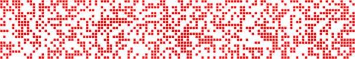
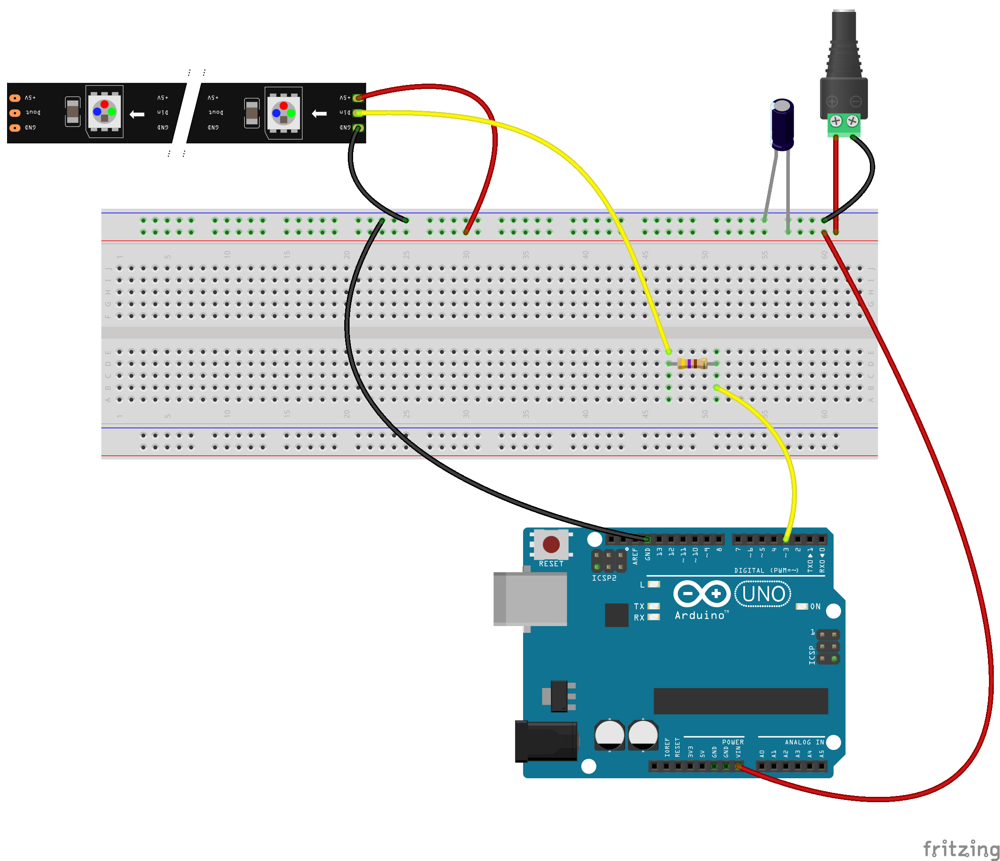
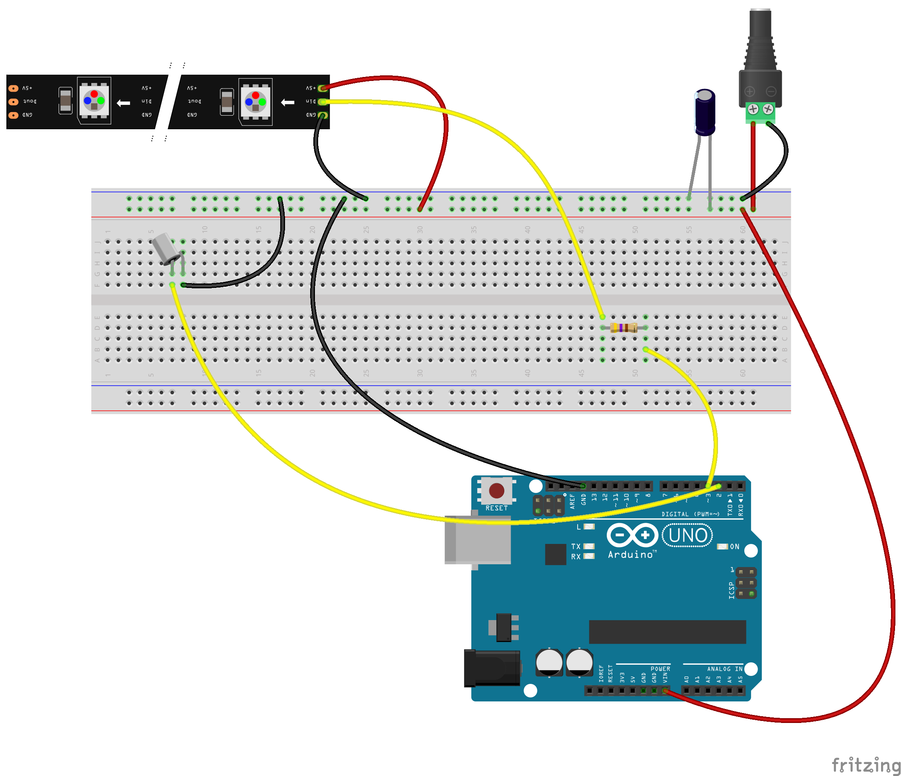
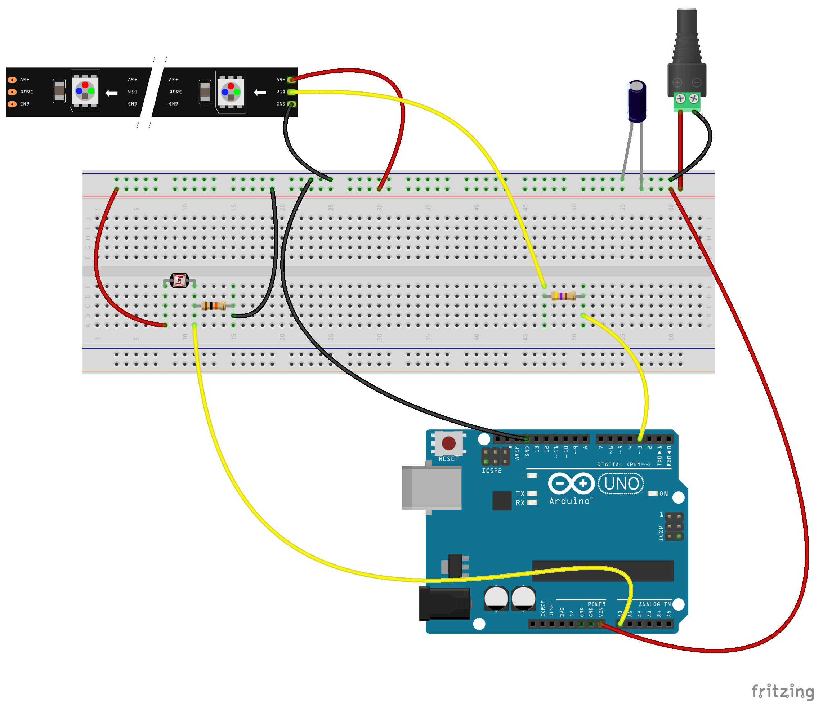

# blinkenlichten @hbk-bs




## FastLED Starter

Starter sketch to get up and running with the [FastLED](https://github.com/FastLED/FastLED) library and the LEDs we have currently at @hbk-bs (WS2811 Color Order RGB).
Make sure to adjust the `NUM_LEDS` to the number of LEDs you are using.


### Gotchas to know about LEDs and FastLED

**RGB vs HSV:** Even when it has HSV built in it uses a range of 0 to 255 for all the values rather then 360, 100, 100 what we are used from using p5.js or Processing. Here are two sketches (p5.js and Processing) to convert these colors.


```js
let h = 330;
let s = 80;
let b = 80;

function setup() {
  createCanvas(400, 400);
  colorMode(HSB, 360, 100, 100);
  let c = color(h, s, b);

  background(c);
  fill(0); // black text
  text(`H: ${floor(map(h, 0, 360, 0, 255))}`, 10, 10);
  text(`S: ${floor(map(s, 0, 360, 0, 255))}`, 10, 30);
  text(`B: ${floor(map(b, 0, 360, 0, 255))}`, 10, 50);
}
```

```java
float h = 330;
float s = 80;
float b = 80;
colorMode(HSB, 360, 100, 100);
color c = color(h,s,b);

background(c);
text("H: "+floor( map(h, 0, 360, 0, 255)), 10, 20);
text("S: "+floor( map(s, 0, 360, 0, 255)), 10, 40);
text("B: "+ floor(map(b, 0, 360, 0, 255)), 10, 6
```


**Common Ground:** When using an external power supply the LEDs, the board and the supply need to be connected on their GND (it is called common ground). If not the LEDs will be wonky.

**Power Supply:** We currently have 5V 2A power supplies at hand. This means we can run around 30 LEDs at full capacity. If you need more LEDs add more Amps.

```plain
Total length: 40 meters
Light source: F8 RGB with integrated WS2811 IC
Number of LEDs: 50 LEDs per strand
Operating voltage: DC 5V
Power: 0.3 W per LED
Lamp spacing: 8cm
Hole diameter: 12 mm
Connection: Red: +5V; White: DATA; Blue: GND


Current per LED = 0,3W ÷ 5V = 0,06A = 60mA
50 LEDS × 60 mA ÷ 1,000 = 3 Amps minimum
30 LEDS × 60 mA ÷ 1,000 = 1.8 Amps minimum
```

- LEDS: https://amzn.eu/d/d1sZh2n
- Power Supply: https://amzn.eu/d/efzY4bn

To learn more about connecting LEDs (why the capacitor on the power supply, why the resistor on the data pin) read Adafruits [LED überguide!](https://learn.adafruit.com/adafruit-neopixel-uberguide/powering-neopixels)

## Tilt Switch (debounced)

This sketch pairs one LED with a tilt switch and fades it on and off when the switch changes it's state.




## Light Dependent Resistor (ldr)

This sketch dims a LED based on the light coming in from the LDR. This can be used as the basis for other analog sensors. e.g. Electret mic (audio reactivity), GAS sensors (air quality),




## From p5.js to Arduino

This sketch is more advanced,. It needs a camera, a browser, Node.js and 3 LEDs. The related JS source code can be found here https://github.com/ff6347/p5-toino

It separates the image coming in from the camera into three areas. It dialtes the image to mostyl black and white. If there is a change in the pixel color ot sends from the p5.js frontend to the Node.js backend via websockets some info [1,0,1] where 1 stands for movement in the area and 0 for none. This data is passed on to the Arduino that is connected via serial. The values are mapped to the LEDs connected to the board.

Why not webserial? We tried using some implementation of webserial for p5.js but the results where flaky at best. Also Browsers like Firefox and Safari will never implement Webserial (at least for now). So having a chromium bound installation is not desired by the authors.


